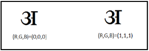
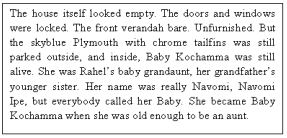
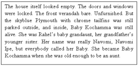
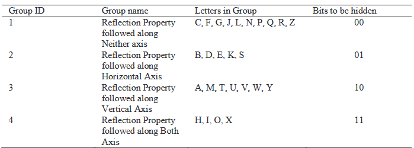
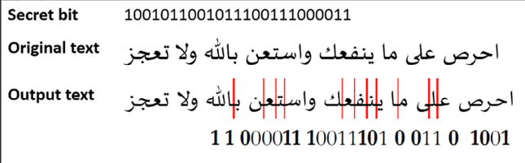
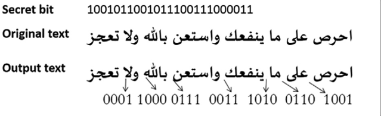

# Ukrywanie informacji w tekście
Projekt z przedmiotu Staganografia na kierunku Informatyka Akademii Górniczo-Hutniczej w Krakowie, dotyczący ukrywania informacji w tekście.

## Autorzy
- Hubert Czader ([@HubertCzader](https://github.com/HubertCzader))
- Mateusz Zalewski ([@a-float](https://github.com/a-float?tab=following))

## Spis treści:
1. [Wstęp](#1-wstęp)
2. [Aktualny stan wiedzy](#2-aktualny-stan-wiedzy)
3. [Przegląd literatury](#3-przegląd-literatury)
4. [Bibliografia](#4-bibliografia)

## 1. Wstęp

Celem projektu jest opracowanie aplikacji desktopowej umożliwiającej ukrywanie znaków w tekście za pomocą steganografii, wykorzystującej techniki takie jak pisanie znaków w kolorze identycznym z tłem dokumentu oraz modyfikację kompozycji tekstu. Aplikacja będzie oferować prosty i intuicyjny interfejs użytkownika, umożliwiający łatwe ukrywanie informacji w tekście oraz ich późniejsze odzyskiwanie. Dodatkowo, projekt zakłada ewentualne rozszerzenie funkcjonalności aplikacji o dodatkowe metody steganografii, co pozwoli na zwiększenie jej wszechstronności i możliwości zastosowania w różnych kontekstach.

## 2. Aktualny stan wiedzy

Steganografia jest metodą utajniania informacji w sposób, który maskuje ich obecność przed nieuprawnionymi obserwatorami. Proces ten obejmuje umieszczanie danych w nośnikach, takich jak obrazy, dźwięki czy teksty, przy minimalnym wpływie na percepcję nośnika przez osoby nieświadome istnienia ukrytych treści. Odbiorca może później identyfikować i odzyskiwać zakamuflowane dane przy użyciu dedykowanych narzędzi lub algorytmów steganograficznych. Steganografia znajduje zastosowanie w rozmaitych dziedzinach, w tym w dziedzinie bezpieczeństwa informacji oraz kryptografii. W ramach projektu skupiono się jedynie na dziedzinie steganografii zajmującej się ukrywaniem informacji w tekście.

Poniżej przedstawione są najpowszechniej stosowane metody ukrywania danych w tekście.

### Metoda semantyczna
Metoda semantyczna polega na zmienianiu znaczenia słów w tekście w celu ukrycia wiadomości. Wykorzystuje synonimy, które posiadają to samo znaczenie, co pozwala skuteczniej ukryć informację. Poprzez wykorzystanie zarówno głównych, jak i drugorzędnych znaczeń słów, można ukryć wiadomość w tekście. Ta metoda oferuje wysoki poziom zabezpieczeń, ponieważ nawet techniki optycznego rozpoznawania znaków (OCR) nie są w stanie wykryć ukrytej wiadomości. 

### Metoda składniowa
Metoda składniowa polega na modyfikowaniu składni tekstu, poprzez dodawanie znaków interpunkcyjnych lub stosowanie innych zapisów wyrazów. Przykładowo, przecinek lub kropka mogą być używane do ukrycia poufnej informacji. Innym przykładem może być różnica w zapisie słów pomiędzy amerykańskim a brytyjskim angielskim. Wykorzystanie tych języków zwiększa skuteczność tworzenia obiektu steganograficznego, ponieważ szansa wykrycia ukrytej wiadomości przez atakującego jest minimalna. 

### Kodowanie cech
Kodowanie cech to proces modyfikowania różnych właściwości tekstu, takich jak wysokość, kolor lub czcionka, w taki sposób, aby ukryć w nim znaczącą wiadomość. Utworzony w ten sposób tekst nazywa się tekstem osłonowym, czyli tekstem będącym nośnikiem sekretnej informacji. Metoda ta polega więc na wykorzystywaniu specyficznych atrybutów lub struktur tekstu do ukrywania dodatkowej informacji. Ukryta wiadomość jest wykrywana jedynie przez nadawcę i zamierzonego odbiorcę po zmianie cech tekstu, a osoba trzecia nie jest w w stanie niczego wykryć wewnątrz tekstu.

### Steganografia tekstu w losowych sekwencjach znaków i słów
Metoda steganografii opierająca się na losowych sekwencjach znaków i słów na na celu ukrycie wiadomości na przypadkowych miejscach w tekście. Wprowadza różne sekwencje słów i znaków na tych losowo wybranych miejscach. Jednakże ta metoda nie jest odpowiednia, ponieważ łatwo przyciąga uwagę osób trzecich, co może prowadzić do jej odczytania jako formy szyfrowania, a nie steganografii.

### Steganografia opierająca się na konkretnych znakach w słowach
Metoda ta polega na wyborze określonych znaków z pewnych słów, aby ukryć znaczącą wiadomość. Metoda ta wymaga silnych umiejętności obliczeniowych umysłu w celu ukrycia komunikatu w taki sposób, że odbiorca nie zauważy ukrytej treści. Istnieje ograniczona liczba języków, które wspierają tę technikę, gdyż znaki słów tylko w niektórych językach mogą być użyte do ukrywania wiadomości. 

### Sekwencja słów
Metoda sekwencji słów w steganografii polega na ukrywaniu tajnych informacji w tekście, poprzez umieszczanie ich w odpowiednio dobranych sekwencjach słów, które na pierwszy rzut oka wyglądają na naturalne lub przypadkowe. Ogólna idea polega na zakodowaniu tajnej wiadomości w pewnych właściwościach tekstu, często używając rzeczywistych elementów detekcji do zakodowania jednego lub więcej bitów informacji na słowo. Mapowanie pomiędzy sekwencjami leksykalnymi a sekwencjami bitów może wymagać użycia księgi kodowej. Wynika to z faktu, że bity w tekście są używane do zakodowania leksykalnej wiadomości. 

### Sekwencja znaków
Metoda sekwencji znaków w steganografii tekstowej wykorzystuje właściwości długości słowa oraz częstości występowania liter w języku, aby generować słowa do ukrycia. Dzięki temu uzyskuje się tekst, który ma takie same właściwości statystyczne jak rzeczywiste słowa w danym języku. 

### Znaki białe
W tekście można wkomponować wiele białych znaków, które spełniają rolę nośnika ukrytej informacji. Mogą one zostać umieszczone zarówno na początku, jak i na końcu linii, a także na początku lub na końcu akapitu. Ponadto, wewnętrzne obszary tekstu również mogą być wykorzystane do zakamuflowania wiadomości. Zastosowanie białych znaków stanowi efektywny środek do utrudnienia dostępu do zawartych danych. Niemniej jednak, jeżeli edytory tekstu zostaną użyte w celu eliminacji tych znaków, integralność tekstu zostanie nadszarpnięta.

### Przesuwanie słów
Metoda opiera się na dokonywaniu poziomych przesunięć słów w tekście, w celu maskowania znaczącej wiadomości. Odległość między poszczególnymi słowami jest dostosowywana w sposób, który pozwala na ukrycie informacji. Wewnętrzne odstępy w obrębie słów powinny być różne, aby wygenerować tekst osłonowy. Odbiorca musi także posiadać informację dotyczącą przesunięcia słów, aby wydobyć ukrytą wiadomość za pomocą steganografii. Jeśli w metodzie przesuwania słów istnieją różne możliwości miejsc, to dekoder powinien otrzymać oryginalny tekst, aby możliwe było wykrycie prawidłowej informacji po stronie dekodera. 

### Przesuwanie linii
Metoda przesuwania linii służy do modyfikowania tekstu poprzez przesuwanie linii w pionie. Przesuwanie linii prowadzi do powstania określonego wzoru w tekście, który jest wykorzystywany do generowania tekstu osłonowego. Przesunięcie jest realizowane poprzez przesunięcie linii tekstu o określony stopień w kierunku pionowym. 

### Skróty
Generowanie skrótów w tekście polega na zastępowaniu wyrazów lub fraz słowem skróconym, co skutkuje zmniejszeniem tekstu i ukryciem informacji. Skróty mogą być wykorzystane do ukrycia wiadomości, ponieważ wiele słów może zostać zastąpionych jednym skrótem, co tworzy inną interpretację tekstu i pomaga w generowaniu tekstu osłonowego. Zamierzony odbiorca powinien znać skróty używane przez nadawcę, a potencjalny atakujący może nie wykryć tekstu osłonowego. 

## 3. Przegląd literatury

### Metoda wykorzystująca kolorowanie liter przy użyciu zbliżonych wartości RGB [1]

Algorytm ten wykorzystuje cechy formatowania tekstu, gdzie identyczne znaki, pokolorowane przy użyciu następujących po sobie lub zbliżonych wartości RGB, stają się wizualnie nieodróżnialne, co przedstawiono na poniższym rysunku. 

  
Niezauważalne zmiany [1]

Przykładowo litera A w alfabecie `dewanagari` (UNICODE) została pokolorowana za pomocą wartości RGB `000` i `111`, które są wzajemnie trudne do odróżnienia. Właściwość ta jest wykorzystywana w celu ukrywania danych w plikach tekstowych. Konkretnie, tekst o wartości `RGB (0, 0, 0)` (nazwany C0) jest przypisywany jako 0 binarne, zaś tekst o wartości `RGB (1, 1, 1)` (nazwany C1) jest przypisywany jako 1 binarne. W ten sposób, na przykład, wiadomość `0110` może być ukryta jako cztery litery o kolorach (C0, C1, C1, C0). Procedura ta zachowuje wizualną integralność pliku tekstowego, a jednocześnie pozwala na wykrycie wiadomości przy pomocy specjalnie zaprogramowanego oprogramowania.

### Metoda ukrywania znaków w liście słów [2]

Metoda ta i ukrywa wiadomość w liście słów, nie używając żadnego specjalnego znaku. Każdy znak jest ukryty w słowie o określonej długości. Pierwsza litera słowa jest determinowana przez maskowanie sumy cyfr wartości ASCII tego znaku do angielskiego alfabetu. Jeśli suma cyfr wynosi 1, to początkowa litera słowa będzie 'a'; jeśli 2, to 'b', i tak dalej. Ponieważ długość i początkowa litera słów zależy od wartości dziesiętnej osadzonych znaków, okładka jest generowana dynamicznie.

### Metoda ukrywania znaków w paragrafach [2]

Podejście to wykorzystuje uprzednio określony plik osłonowy, który może być dowolnym znaczącym fragmentem tekstu w języku angielskim i może być pobrany z dowolnego źródła (na przykład fragment paragrafu z gazety/książki). Podejście to działa poprzez ukrywanie wiadomości przy użyciu pierwszej i ostatniej litery słów z pliku osłonowego. Po przekształceniu tekstu szyfrogramu w strumień bitów, każdy bit jest ukrywany poprzez wybór słowa z pliku osłonowego i użycie albo pierwszej, albo ostatniej litery tego słowa, w zależności od bitu, który ma zostać ukryty. Bit 0 lub 1 jest ukrywany poprzez sekwencyjne odczytywanie słowa z pliku osłonowego i dodanie na początek lub koniec odpowiednio litery początkowej lub końcowej tego słowa do klucza stego. Słowo mające taką samą pierwszą i ostatnią literę jest pomijane. Ponieważ nie dokonuje się żadnych zmian w pliku osłonowym, plik osłonowy oraz odpowiadający mu plik steganograficzny są identyczne.

     
Plik osłonowy (po lewej) i plik steganograficzny (po prawej) [2]

### Metoda generacji strzeszczenia tekstu z wykorzystanie symetrii liter [3]
Metoda zaproponowana w tej pracy koduje wiadomość przy pomocy pierwszych liter każdego zdania. Litery alfabetu łacińskiego podzielone są na 4 rozłączne zbiory. Litery posiadające symetrię pionową, litery posiadające symetrię poziomą, litery posiadające symetrie poziomą oraz pionową oraz litery nie posiadające żadnej z nich. Każdej grupie przyporządkowana zostaje para bitów 00, 01, 10 lub 11.

  
Grupowanie liter na podstawie ich symetrii [3]

Proces ukrywania wiadomości wiąże się z modyfikacją tekstu źródłowego. W celu zmniejszenia prawdopodobieństwa wykrycia obecności wiadomości, cover-text tworzony jest poprzez usunięcie z tekstu żródłowego zdań, których pierwsza litera nie koduje potrzebnej w danym etapie pary bitów.

Proces kodowania wiadomości `0111` w tekście `Strusie emu to duże ptaki. Potrafią biegać bardzo szybko. Mieszkają w Australii. Ich dietę stanowią trawy, owoce oraz owady.` wygląda następująco.

`Strusie emu...` - `S` - 01 - zostawiamy  
`Potrafią bi...` - `P` - 00 - pomijamy  
`Mieszkają w...` - `M` - 10 - pomijamy  
`Ich dietę s...` - `I` - 11 - zostawiamy

Wygenerowanym strzeszczeniem jest więc `Strusie emu to duże ptaki. Ich dietę stanowią trawy, owoce oraz owady.`

Ponieważ tekst wynikowy jest podzbiorem zdań testu źródłowego, z dużym prawdopodobieństwem zawiera on tekst poprawny semantycznie co zmniejsza prawdopodobieństwo wykrycia. Atutem tego podejścia jest także odporności na przepisywanie.

Wadą tego podejścia może być różna różnica w rozmiarach grup liter. Liter posiadających obie symetrie, które kodują `11` jest tylko cztery, ponadto jedną z nich jest `X`. Może to wiązać się z trudnością kodowania tej pary bitów, a przez to zwiększać rozmiar wymaganego tekstu źródłowego.

### Pseudo spacje w językach Arabskich [4]
W związku z wykorzystywaniem innego alfabetu, język arabski oferuje inne możliwości steganograficzne niż alfabet łaciński. W artykule opisane są dwie metody ukrywania wiadomości w tekście.

Opierają się ona na wykorzystaniu dwóch znaków specjalnych: `kashidy` oraz `pseudo-spacji (PS)`. Kashida jest znakiem wykorzytywanym do justowania tekstów arabskich. Wydłuża ona pewne poziome linie wewnątrz słów. 
Pseudo spacja jest znakiem który nie pozwala na połączenie się otaczających go znaków, nie tworząc jednocześnie odstępu między nimi.

Pierwsza z nich `Kashida-PS`, jest rozszerzeniem metody przedstawionej w [5]. Ukrywa ona większą liczbę bitów niż jej poprzednik, ponieważ wykorzystują każdą literę oraz znak biały do kodowania wiadomości. Przed każdą literą, która akceptuje kashidę, wstawiana jest jedna kashida w celu zakodowania 0 lub dwie w celu zakodowowania 1. Jeśli znak nie akceptuje kashidy lub jest znakiem biały, podobnie wstawiane są przed nim dwa lub jeden znak PS.

  
Przykład zastosowania metody Kashida-PS, źródło [4]

Druga metoda, nazwana `PS-betWords` wykorzystuje wyłącznie znak PS. Dzieli ona strumień bitów wiadomości do ukrycia na grupy o rozmiarze n. Zastosowanie większych wartości n skutkuje zwiększeniem pojemności tekstu, co wiąże się jednak z większą różnicą w rozmiarach tekstu źródłowego oraz cover-textu, co zmniejsza bezpieczeństwo tej metody. (Security > L.Digital standard). 

Algorytm osadzania wiadomości jest prosty. Każdy znak spacji koduje n bitów. Dokonywane jest to poprzez wstawianie przed nim znaków PS w liczbie równej wartości binarnej kodowanej grupy. Tak więc w celu zakodowania grupy `0101` wstawione zostanie 5 znaków PS, a `11000` 24 znaki.

  
Przykład zastosowania metody PS-betWords, źródło [4]

W przeciwieństwie do metody pierwszej, metoda ta jest możliwa do zaimplementowania w każdym języku, a także zapewnia pełną wizualną zgodność tekstu sprzed i po ukryciu w nim wiadomości.

Metoda `Kashida-PS` poprzez wykorzystanie kashidy oraz znaków spacji jak i liter osiąga natomiast większą pojemność.

## 4. Bibliografia

###### [1] https://www.researchgate.net/profile/Anirudra-Diwakar/publication/371286387_A_Novel_Approach_to_Text_Steganography/links/647cad9f79a72237650da99b/A-Novel-Approach-to-Text-Steganography.pdf
###### [2] https://arxiv.org/ftp/arxiv/papers/1302/1302.2718.pdf
###### [3] https://www.sciencedirect.com/science/article/pii/S2212017313004970
###### [4] https://www.sciencedirect.com/science/article/pii/S1319157819304719
###### [5] https://drive.uqu.edu.sa/_/aagutub/files/_/publications_conferences/Langkawi_ICMSCE_Feb/c_af_paper_published.pdf
